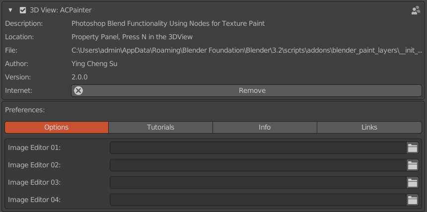
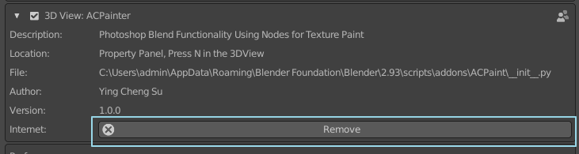
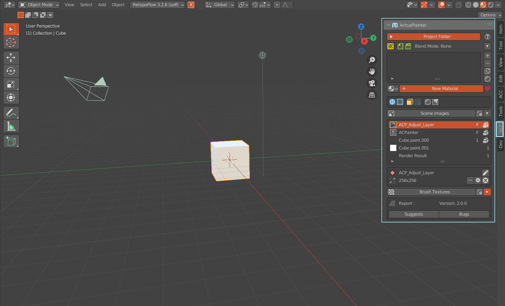

******
Start
******

Install
=======

    When you purchase ACPainter, you will have access to a .zip file containing the entire plug-in package. 
    In Blender, select the install button in the Edit ‣ Preference ‣ Addon panel to install the zip file. 
    If the installation is successful, you can see the relevant information of ACPainter.

    ACPainter Addon

Update
=======

    1. Completely uninstall old version ACPainter from Blender.
    2. Close and restart Blender to ensure all cache files are cleared.
    3. Install the new version normally.

    Uninstall ACPainter    

Finding ACPainter in Blender
============================

    ACPainter is located in the tab on the right panel of 3D Viewer.

    ACPainter location of windows 

Ready to TexturePaint
=====================
    ACPainter has automated the tedious node setting process, the main setting process is as follows:
        
    1. Select the 3DMesh object to paint.
    2. The Material given to the selected object.
    3. Confirm that the material node is Material Output, the input channel is Surface, and add a set of LayerChannel.
    4. Added PaintLayer.
    5. Switch to TexturePaint mode to start painting. 

Important Notes (Please Read)
=============================
    In order to have a comfortable experience using ACPainter, please be careful of the following behaviors:

    1. Please avoid using related texture Painter tools at the same time, because related tools may use roughly the same but different program behaviors, and may interfere with each other, making ACPainter unable to obtain the expected behavior. If you must mix them, please keep an eye out for related anomalous behavior.
    2. For material nodes created by ACPainter, please do not make relevant changes through the ACPainter panel(unless you understand the relevant operating principles and risks), otherwise ACPainter may malfunction.
    3. In addition to the above points, ACPainter should be a very friendly and stable tool, I wish you a good experience.