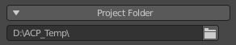
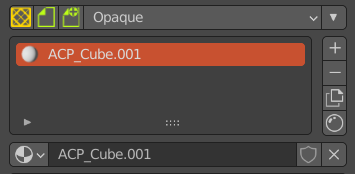
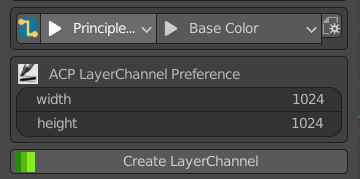
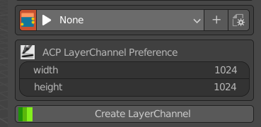
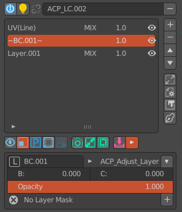
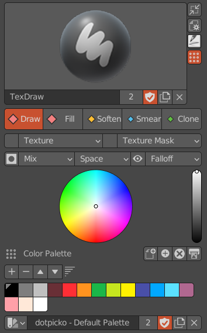
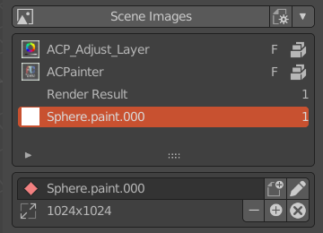
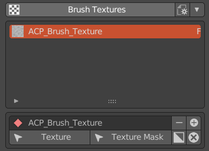
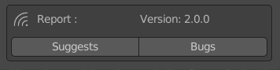

******************************
Overview of the Main Interface
******************************

Project Folder Panel
====================
The project folder is used to store various data generated by ACPainter, such as: Blender files, layer textures, etc.

   Project folder panel

Object Material List Panel
==========================
The material browser is used to check the material status of the selected object, and has functions such as adding materials, 
deleting materials, copying materials, etc.

   Object material list panel

Layer Channels Panel
====================
There are two modes in the Layer Channels panel: Line Mode and Free Mode. The line mode can directly use the function of the layer channel 
through the selected material node and input channel. Free mode is suitable for more advanced users. It is recommended to use it after you 
are more familiar with ACPainter. You need to connect the material nodes yourself, but the application changes more.

   Layer channels panel: Linear Mode

   Layer channels panel: Free Mode

Layer List Panel
================
The layer list panel displays the layer arrangement status in the layer channel, and a lot of functions can be performed in this panel, 
such as adding and deleting layers, switching painting color mode, camera projection function and so on.

   Layer list panel

Brush List Panel
================
The brush panel displays the brush functions most needed for texture painting, improves the display method of necessary information, 
the information display is more intuitive, the operation area is more concentrated, and the use is faster; the brush panel also provides more than 
ten groups of easy-to-use brush settings; support Load and export Gimp color chip files (.gpl), and get the palette you want to use at any time.

   Brush list pane

Scene Image Browser
===================
The image browser displays all the image data in the Blender scene, including the number of users of the image, whether it is packaged in a file, 
and you can directly perform corresponding operations on the image, such as adding an image, deleting an image, and so on.

   Scene image browser   

Brush Texture Browser
=====================
The image browser displays all textures in the Blender file, and can directly perform corresponding operations on textures, such as adding textures, 
deleting textures, inverting textures, etc.

   Brush texture browser

Issue Suggestion Reporting Panel
================================
For ACPainter's questions and suggestions, you can open the web form report here.

   Issue suggestion reporting panel
