****************************
Detail of the Main Interface
****************************

Project Folder Panel
=====================
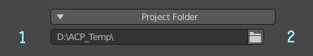
   
   Project folder panel

* 1.Project folder path.
* 2.Project folder selection button. The absolute path and relative path can be modified in it, hold down Alt and click to open the selected folder with the file explorer.

      .. note:: 
         If the path is not an absolute path and causes related operation errors, just change the path to an absolute path.

Folder Browser 
---------------------------------------------------------------------------------------
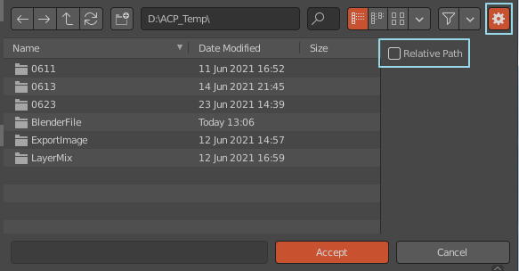

   Change the relative path to an absolute path when opening the folder browser

Object Material List
=====================
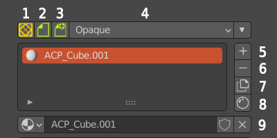

   Object material list

* 1.Convert to AssetMode environment.
* 2.ACPainter archiving function: when archiving, the unarchived images will be stored together. If the file has been archived, it will be overwritten with the original name, if it has not been archived, it will be archived with the name "ACP(Save)-date".
* 3.ACPainter save a new file function: When saving a new file, the unsaved image will be saved together. Save a file with the name "ACP(Save)-Date".
* 4.The display mode in the material 3D window: there are four display modes: Opaque, Alph Clip, Alpha Hashed, and Alpha Blend.
* 5.Increase the material.
* 6.Delete the material.
* 7.Duplicate the material.
* 8.Open the material editor.
* 9.Scene material list bar.

   .. note:: 
      The archive function needs to set up the project folder to work properly.

Layer Channels Panel
=====================
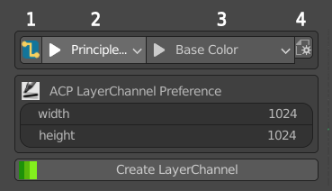

   Layer channel panel - Liner mode

* 1.Linear mode (can be switched to free mode). Directly connect the layer channel to the specified material node position.
* 2.Select the material node supported by ACPainter in the material.
* 3.Select the input channel supported by ACPainter in the material node.
* 4.Layer channel - Filter option of Linear mode .

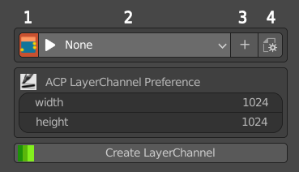

   Layer channel panel - Free mode

* 1.Free mode (can be switched to straight mode). The layer channel node is generated in the material, which must be connected and used by itself.
* 2.Layer channel list.
* 3.Increase the layer channel.
* 4.Layer channel - Function option of free mode .

Create Layer Channels panel 
---------------------------------------------------------------------------------------
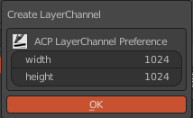

   Create a layer channel panel

* Width: The width of layer channel images.
* Height: The height of layer channel images.

Layer List
=====================
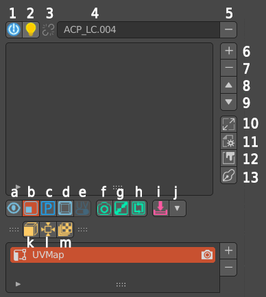

   Layer list

* 1.Set 3DViewport as ACPainter drawing environment.
* 2.Set the material to display the channel color effect of this layer.
* 3.Display whether this layer channel has an imported node source (can be switched).
* 4.Layer channel name.
* 5.Delete the layer channel.
* 6.Add layers.
* 7.Delete the layer.
* 8.Layer up.
* 9.Layer down.
* 10.Layer channel color environment setting and image scaling panel.
* 11.Layer tool settings panel. .
* 12.Open the image editor.
* 13.Use the essential mode (try to turn off unnecessary panel displays).

* a.Single layer painting mode.
* b.Show layer image switch.
* c.PS_Mode color mixing mode.
* d.Object window display mode switching.
* e.Switch the plane layout of 3D model and UV.
* f.Camera projection – open the screenshot to external 2D editing software.
* g.Camera Projection – The projection is imported from an external 2D editing software.
* h.Camera self-projection – directly project onto the model after capturing the picture.
* i.Merge visible layers (press the Ctrl key to merge using custom calculation parameters).
* j.Storage option switch at the bottom.
* k.UV-Mesh expansion (the original model will be copied). Unwrap the selected 3D model into a flat layout of UVs.
* l.Six-direction panoramic projection of the camera.
* m. Export the visual layer to the project folder.

   .. note:: 
      The function of exporting image files needs to set up the project folder to work normally.

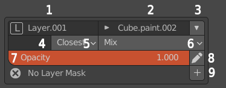

   Layer information panel

* 1.Layer name (rename freely).
* 2.The image name corresponding to the layer (renameable).
* 3.Layer parameter storage option switch
* 4.The UV name corresponding to the layer (if blank, use the default value).
* 5.Scaling layer image calculation method.
* 6.Layer blend mode.
* 7.Layer Opacity.
* 8.Export the layer to external 2D software for editing.
* 9.Increase the layer mask.

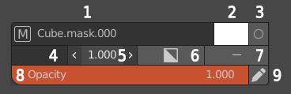

   Layer mask information panel    

* 1.The image name corresponding to the layer mask (renameable).
* 2.The base color corresponding to the layer mask (white or black, which affects the transparency function).
* 3.Edit the paint layer mask.
* 4.The UV name corresponding to the layer mask (if blank, use the default value).
* 5.Layer mask edge sharpness.
* 6.Invert the layer mask.
* 7.Remove the layer mask.
* 8.Layer mask opacity. 
* 9.Export the layer mask to an external 2D software editor.

New Layer Panel
---------------------------------------------------------------------------------------
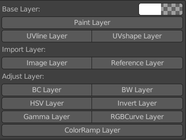

   New layer panel

* Paint Layer: Paint layer, you can set the color and opacity.
* UVline Layer: The wireframe layer of the model UVlayout.
* UVshape Layer: The wireframe and shape layer of the model UVlayout.
* Image Layer: Image layer, imported from external images into Blender, after importing, it will no longer be linked with the original file, and you can continue to draw and modify.
* Reference Layer: The reference layer is imported into Blender from external images. After importing, it continues to be linked with the original file. It cannot be modified by drawing, but it can be updated with the original file.
* BC Layer: Adjustment layer, adjust the brightness and contrast of the layer image.
* BW Layer: Adjustment layer, convert the layer image into a grayscale image.
* HSV Layer: Adjustment layer, adjust the hue, saturation, and lightness of the layer image.
* Invert Layer: Adjustment layer, invert the image of the layer.
* Gamma Layer: Adjustment layer, adjust the Gamma value of the layer image.
* RGBCurve Layer: Adjustment layer, adjust the RGB value curve of the layer image.
* ColorRamp Layer: Adjustment layer, adjustment layer image gradient corresponding effect.

   For more detailed usage, please refer to the layer chapter

Layer Channel Image Scale Panel
---------------------------------------------------------------------------------------
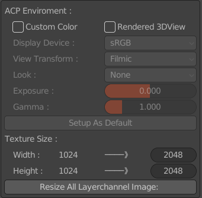

   Layer channel color environment setting and image scale panel

* Custom Color: Use custom color environment parameters (PS_Mode will force the color environment parameters of this mode).
* Rendered 3DView: Set the 3DViewport as the Rendered type when it is the ACPainter drawing environment.
* Setup As Default: Set the above color environment parameters to default values.
* Width: The image width value of the current layer channel\The value of the image width of the layer channel after modification.
* Height: The height value of the channel image of the current layer\The height value of the channel image of the layer to be modified.
* Resize All Layerchannel Image: Scale images in all layer channels

Layer Tool Settings Panel
---------------------------------------------------------------------------------------
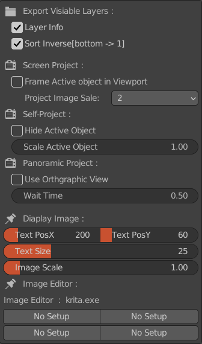

   Layer tool setting panel

* Layer Info: Whether the output image layer carries image information, layer sequence number, blending method, and opacity.
* Sort Inverse: The sorting method of the output image layer. When enabled, the bottom layer is the first layer, otherwise, the top layer is the first layer.
* Frame Active Object in Viewport: Whether to maximize the model in the viewport when the camera is projecting a capture.
* Project Image Scale: The size ratio of the captured image when the camera is projected. The larger the value, the clearer it is, but the slower the speed.
* Hide Active Object: Hide the selected object during self-projection and panoramic projection.
* Scale Active Object: Scale the selected object during self-projection and panoramic projection.
* Use Orthgraphic View: When panoramic projection, use no perspective orthographic view.
* Wait Time: When panoramic projection, the time interval between each projection.

   For more detailed usage, please refer to the layer and camera projection chapter
 
* Text PosX: The horizontal position of the text information on the 3D window.
* Text PosY: The vertical position of the text information on the 3D window.
* Text Size: The text size on the 3D window.
* Image Scale: The scale of the image displayed on the 3D window.
* Image Editor: 4 kinds of external 2D editing software set in ACPainter Addon Perference can be switched.

Brush List Panel
=====================
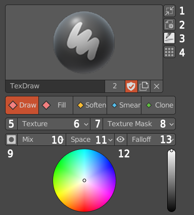

   Brush list panel

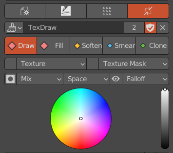

   Miniature brush list panel

* 1. Brush panel zoom out button.
* 2. Brush panel setting option button.
* 3. Load ACPainter brushes.
* 4. Open the color ticket version below.
* 5. Brush Texture display button. Brushes that use Texture will be highlighted.
* 6. Brush Texture setting option button.。
* 7. Brush Texture Mask display button. Brushes that use Texture Mask will be highlighted.
* 8. Brush Texture Mask setting option button.
* 9. Brush lock layer Alpha painting.
* 10. The brush blending mode.
* 11. Brush Stroke type.
* 12. Displays the brush size range.
* 13. The brush strength falloff type.
 
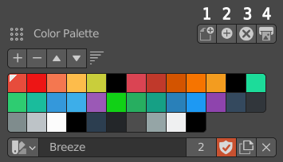

   Color Palette panel

* 1. Loads a new set of palette (Gimp palette File.gpl).
* 2. Adds a new set of palette (Gimp palette file.gpl) to the current palette.
* 3. Deletes the currently selected palette.
* 4. Output Gimp palette file (.gpl).
 

Scene Image Browser
=====================
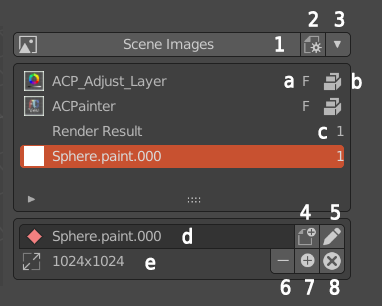

   Scene image browser

* 1.Synchronize the displayed image with the scene image browser.
* 2.Set the number of images displayed in the scene image browser.
* 3.The storage switch of the scene image browser.
* 4.Convert the selected image to a paint layer or a layer mask.
* 5.Export the selected images to external 2D software for editing.
* 6.Delete the image. Image is not deleted if it is used in any layers.
* 7.Import images from outside.
* 8.Delete all scene images without users.
* a.Fake User。
* b.The image is packaged into a file.
* c.Number of users.
* d.Image name (renameable).
* e.Image size.

Brush Texture Browser
=====================
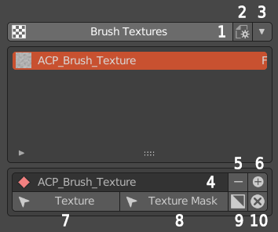

   Texture browser

* 1.Go to the Properties panel to the Textures tab.
* 2.Set the texture browser to display the number of textures.。
* 3.Texture browser storage switch.
* 4.Texture name (renameable).
* 5.Delete the texture.
* 6.Add texture from the outside.
* 7.Assign the texture shown in the texture browser to the texture of the current brush
* 7.Assign the texture displayed in the texture browser to the texture mask of the current brush.
* 8.Invert the texture.
* 9.Delete all textures that have no users.

