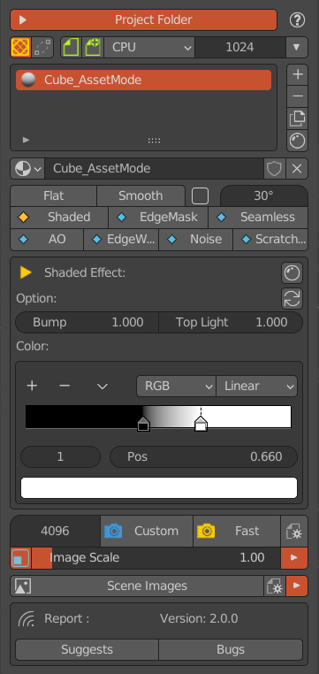

************************************
Overview of the AssetMode Interface
************************************

AssetMode Panel
================
The AsserMode panel contains many of the same parts as the main panel, such as the project folder panel, the object material list panel, 
the scene image browser, and so on. In addition, the AsserMode panel will switch different interfaces according to the selected Shader type. 
Currently supports 7 texture effects.

   AssetMode panel
