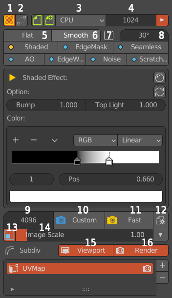
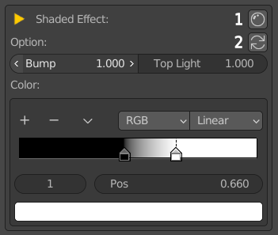
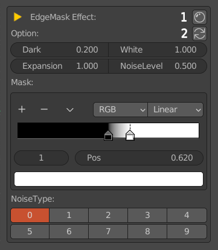
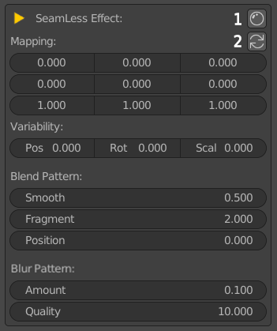
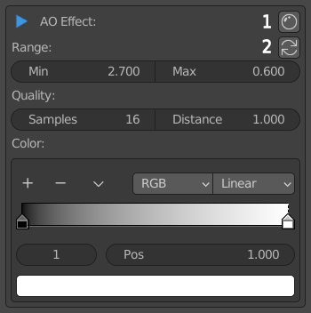
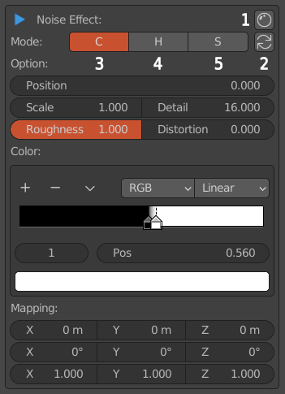
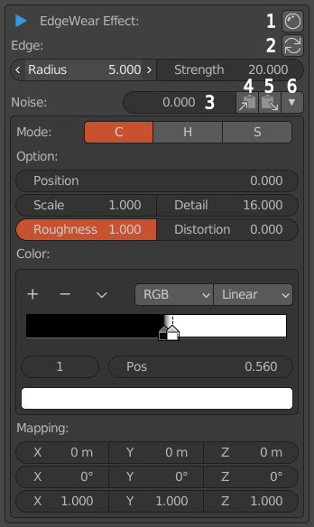
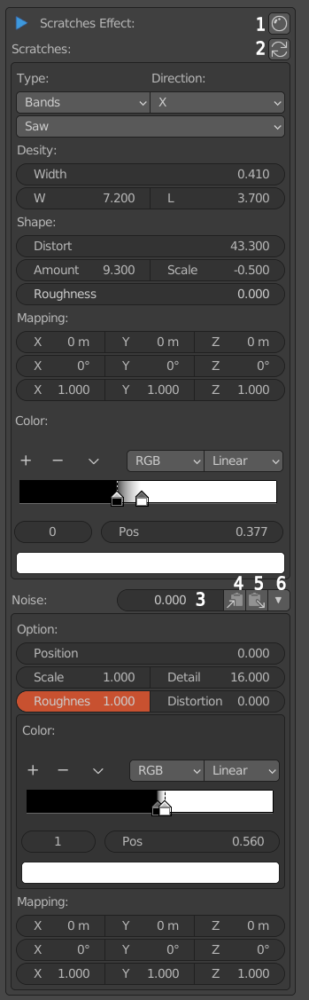

******************************
Detail of AssetMode Interface
******************************

Main Interface Panel of AssetMode
===================================

   
   Main interface panel of assetMode

* 1.Exit AssetMode and return to layer channel status.
* 2.Rebuild the connection between the baked object and the original object.
* 3.The device used for window preview.
* 4.The window previews the number of samples.
* 5.The model is colored with Flat.
* 6.The model is shaded using Smooth.
* 7.Enable the automatic smoothing function.
* 8.Automatically smooth angles.
* 9.Samples of render graph.
* 10.Use the custom samples of render(9) to render the image.。
* 11.Use the fastest samples of render (the render result is not exquisite, except for Shaded Effect).
* 12.AssetMode option panel。
* 13.The image switch displayed on the 3D window。
* 14.The scale of the image displayed on the 3D window。
* 15.Subdiv modifier effect switch when viewport preview。
* 16.Subdiv modifier effect switch when render 。

Shaded Effect
=====================

   
   Shaded Effect panel

* 1.Open the material editor.
* 2.Reset to the default value.
* Bump: Strengthen the light and shadow effect of the concave and convex of the model.
* Top Light: Strengthen the light and shadow effect in the vertical direction of the model.
* Color: Set the color of the light and shadow gradient change.

EdgeMask_Effect
=====================

   
   EdgeMask_Effect panel

* 1.Open the material editor.
* 2.Return to the default value.
* Dark: Texture black intensity.
* White: Texture white intensity.
* Expansion: Control the edge effect at the junction of black and white.
* NoiseLevel: white noise intensity.
* Mask: Controls the threshold value of black and white colors.
* NoiseType: EdgeMask Effect with 10 different effects.

Seamless Effect
=====================

   
   Seamless Effect panel

* 1.Open the material editor.
* 2.Return to the default value.
* MMapping: Projection map coordinate values, left to right are X, Y, Z respectively, and top to bottom are position, rotation and scaling respectively.
* Variability: Projection map coordinate variation value.
* Pos: The positive and negative change value of the position.
* Rot: The positive and negative change value of the rotation.
* Scal: The positive and negative change value of scaling.
* Blend Pattern: Fractal blending texture parameters (change the Variability value to non-zero to have an effect).
* Smooth: Fractal texture smoothness.
* Fragment: Fractal texture fragmentation.
* Position: Fractal texture position.
* Blur Pattern: Blur the fractal texture (it will only work after changing the Variability value to non-zero).
* Amount: Blurred fractal texture intensity value.
* Quality: Blur the fractal texture sample value (the larger the value, the finer it is).

AO Effect
=====================

   
   AO Effect panel

* 1.Open the material editor.
* 2.Reset to the default value.
* Range: The grayscale range of the AO effect.
* Min: The minimum threshold of the AO effect.
* Max: The maximum threshold of the AO effect.
* Quality: The quality of the AO effect.
* Samples: The number of AO effect samples.
* Distance: The distance at which other objects are considered to occlude the shading point.
* Color: The color gradient corresponding to the AO effect.

Noise Effect
=====================

   
   Noise Effect panel

* 1.Open the material editor.
* 2.Return to the default value.
* 3.Noise texture grayscale value color effect.
* 4.Noise texture hue value effect.
* 5.Noise texture saturation value effect. .
* Option: Noise parameter option.
* Position: The displacement value of the Noise texture.
* Scale: The scaling value of the Noise texture.
* Detail: The detail value of the Noise texture.
* Roughness: The roughness value of the Noise texture.
* Distortion: The distortion value of the Noise texture.
* Color: The color gradient corresponding to the Noise texture.
* Mapping: The translation, rotation, and scaling mapping values ​​corresponding to the Noise texture. The first row is the translation value, 
the second row is the rotation value, and the third row is the scaling value.

EdgeWear Effect
=====================

   
   EdgeWear Effect panel

* 1.Open the material editor.
* 2.Return to the default value.
* 3.Noise texture mask intensity value.
* 4.Copy the Noise texture parameters to the Noise Effect panel.
* 5.Copy the texture parameters of the Noise Effect panel to this panel.
* 6.Noise texture parameter panel storage switch.
* Edge：Edge Wear effect edge parameters.
* Radius: Edge width.
* Strength: Edge strength value.
* Noise: Noise texture parameter options, the explanation refers to the Noise Effect panel.

Scratches Effect
=====================

   
   Scratches Effect panel

* 1.Open the material editor.
* 2.Return to the default value.
* 3.Noise texture mask intensity value.
* 4.Copy the Noise texture parameters to the Noise Effect panel.
* 5.Copy the texture parameters of the Noise Effect panel to this panel.
* 6.Noise texture parameter panel storage switch.
* Type: Scratch type and scratch repeat method.
* Direction: edge direction.
* Desity: Scratch density option.
* Width: The scratch width value.
* W: Widthwise, the transverse density of scratches.
* L: Lengthwise, longitudinal density of scratches.
* Shape: Scratch shape options.
* Distort: ​​Scratch distortion value.
* Amount: Distortion noise value strength.
* Scale: Distortion noise scaling.
* Roughness: Distortion noise roughness value.
* Mapping: The translation, rotation and scaling mapping values ​​corresponding to the scratch texture, 
the first row is the translation value, the second row is the rotation value, and the third row is the scaling value.
* Color: The color gradient corresponding to the scratch texture.
* Noise: Noise texture parameter options, the explanation refers to the Noise Effect panel.

