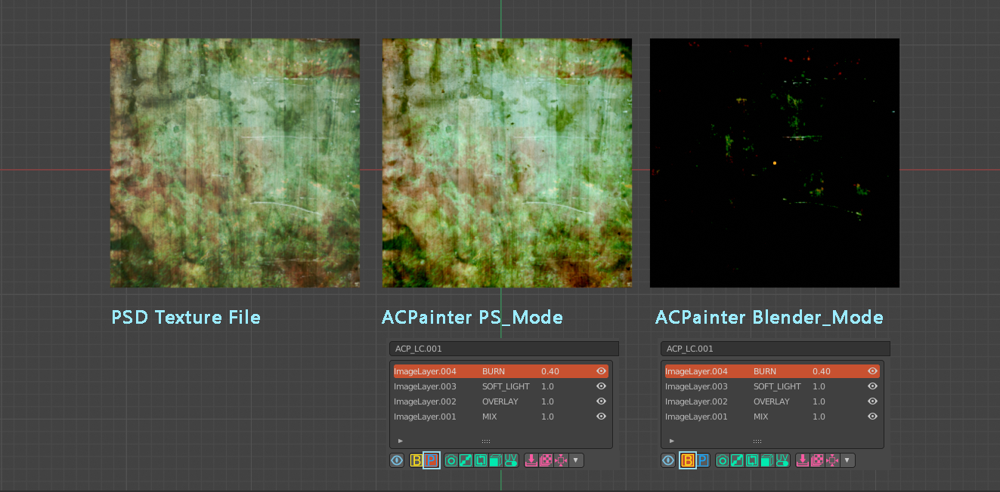
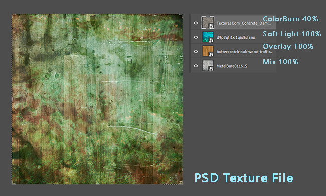
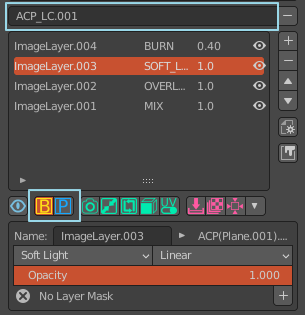
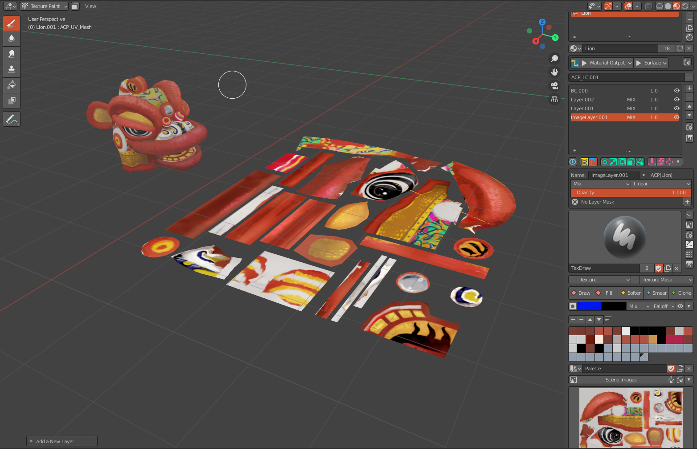

**************
Blending Mode
**************

Comparison of blending modes
============================

If you often use Blender to paint 3D model textures, you will find that Blender’s image blending effect is not like the color rendering effect in 
Photoshop or Krita. Such inconsistency has become the biggest pain in texture painting in Blender, because the same Color images vary greatly in 
different software. In Photoshop and Krita, the same layer and color mixing effects are more colorful and detailed than the preset effects in Blender.

ACPainter tries to reduce such inconsistencies. Only by reducing the color mixing difference between Blender and 2D drawing software, can ACPainter's 
layer system communicate with other 2D drawing software.

The following is using PS Modes of ACPainter to simulate the layers blending effect.

   Comparison of color mixing modes of ACPainter layers

   Description of layer color mixing in PSD file

Two Color Space Mixing Modes
============================
ACPainter provides a new color mixing mode, called PS Mode, which is mainly to simulate the color mixing effect of PSD files to facilitate drawing. 
When PS_Mode is not enabled, the default color mode will be applied (users can customize the color management status to be used), and you can switch 
the PS Mode state at any time, and different layer channels can also apply different color space states, which is convenient for expanding the scope 
of use.

   Layer channel color mixing effect switching

Color Picking Method
====================
* Do not enable PS Mode (default value)
   You can use the color picker in the image editor (ImageEditor) and 3D window (3DViewport) to get the desired color.

* PS Mode
   The mixing color mode of PS Mode provided by ACPainter will convert the image to a different color space, so the color picker in the image editor 
   (ImageEditor) will not be able to obtain the desired color, only from the 3D window (3DViewport) can the desired color be obtained .

   ACPainter provides a method to change the 3D viewport (3DViewport) into a similar image editor (ImageEditor).
      1. Use the UV_Mesh function provided by ACPainter to convert the 3D model into a UV layout.
      2. It can be used with the UV_Mesh switching function to change the UV layout back to the 3D model at any time.
      3. Freely draw and pick colors in the 3D viewport (3DViewport)!

   UV_Mesh function button

   
   With UV_Mesh unfolding function, directly simulate texture painting in the 3D viewport 

