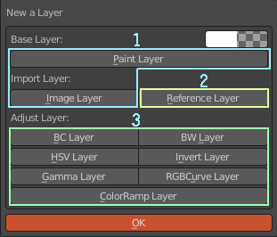
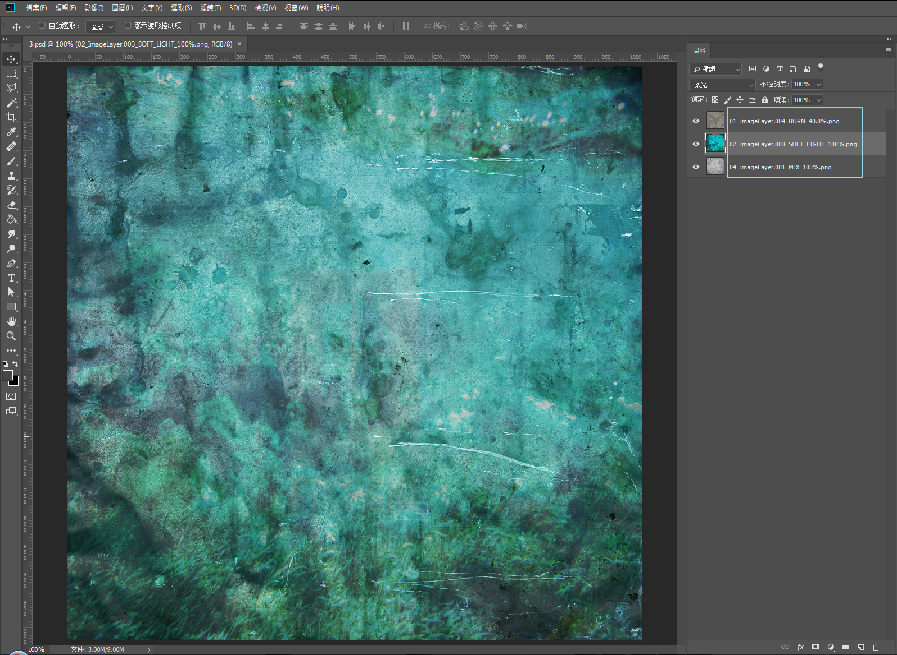

********
Layers
********

Layer Type
==========

   圖層種類   
   
1. Paint layers. There are two types, one is a solid-color painting layer, and the other is a painting layer created by an image 
(imported from outside or an image in Blender). The common point is that you can continue to process and draw on it.
2. Reference layer. The layer that can no longer be processed after the image is imported from the outside is mainly designed to 
import PSD multi-layer files. You can also use this layer to merge ACPainter painting layers into it.
3. Adjustment layers. Color adjustments can be made without affecting other drawing layers and reference layers.

   Layer type representation

Different layer types have different expressions in the layer editor, which can be easily identified. 
Each layer can be added with a layer mask for further adjustments. Image layers refer to drawing layers and reference layers. 

Image Layer Output
==================
ACPainter can output images of painting layers and reference layers, and the process is quite simple.

1.  Set the project folder path.
2.  Select the image layer to be exported, and cancel the display of other layers not to be exported.
3.  Set layer output information (including layer order, blending mode, opacity), sorting direction.
4.  Click the Output Layer function button.
5.  Open File Explorer to confirm. 

   Check before exporting layers

.. figure:: images/Layer_export_option.png
   :alt: Layer_export_option.png
   :align: center
   :width: 300px 

   Setting before output layer

.. figure:: images/Layer_export_file.png
   :alt: Layer_export_file.png
   :align: center
   :width: 500px

   Export layers to the project folder

Composite PSD File – Krita
===========================
1. Enable layer info, set layers to sort correctly, and output layers.
2. Start Krita and create a file that fits the image size of the output layer.
3. The layers of images imported and exported at one time will be arranged in order.
4. According to the imported layer image information, set the layer blending mode and opacity.
5. Save it as a PSD file, and then import it into ACPainter as a reference layer for easy correction at any time.

   Settings of export layers to Krita 

.. figure:: images/Krita_import_01.png
   :alt: Krita_import_01.png
   :align: center
   :width: 400px 

   Opens a new file in Krita 

.. figure:: images/Krita_import_02.png
   :alt: Krita_import_02.png
   :align: center
   :width: 400px 

   Import layers in Krita

   Complete the merged layers

Compositing PSD Files – Photoshop
==================================
1. Enable layer info, set layers to sort correctly, and output layers.
2. Open Photoshop, and the file script loads the file into the stack.
3. Select the output layer images and they will be arranged in order.
4. According to the imported layer image information, set the layer blending mode and opacity.
5. Save it as a PSD file, and then import it into ACPainter as a reference layer for easy correction at any time.

   Settings of export layers to Photoshop 

.. figure:: images/Photoshop_import_01.png
   :alt: Photoshop_import_01.png
   :align: center
   :height: 400px 

   Import layers in Photoshop

.. figure:: images/Photoshop_import_02.png
   :alt: Photoshop_import_02.png
   :align: center
   :width: 400px 

   Import layers in Photoshop

   Complete the merged layers

Merge All Visible Layers
========================
1. After setting the visible layers to be merged, press the layer merge button.
2. After a while, the merged image content will be saved to a new drawing layer, named starting with Composite.
3. The UV space of the selected object determine merge image content.

.. figure:: images/Render_Layer_01.png
   :alt: Render_Layer_01.png
   :align: center
   :width: 700px 

   Turn off the layers that do not need to be synthesized in the layer list

   The visible layers are merged into a new layer

 

