******************
Screen Projection
******************
Blender has a screen projection function in the texture drawing mode of objects, but it is not particularly convenient to use. 
ACPainter has improved the screen projection function based on its own layer system. In addition to the original functions, 
it has added many additional useful functions, even It can be used as a simple 3D instant window baking function.

Improved Screen Projection 
========================================
1. The captured screen range conforms to the size of the 3D window screen, and the main objects in the captured screen are no longer confused by the proportion of the size.
2. When projecting an image to an object, it will detect the projectable layer, greatly reducing the failure rate of projecting an image.
3. It can be used in object mode, which is convenient and fast.

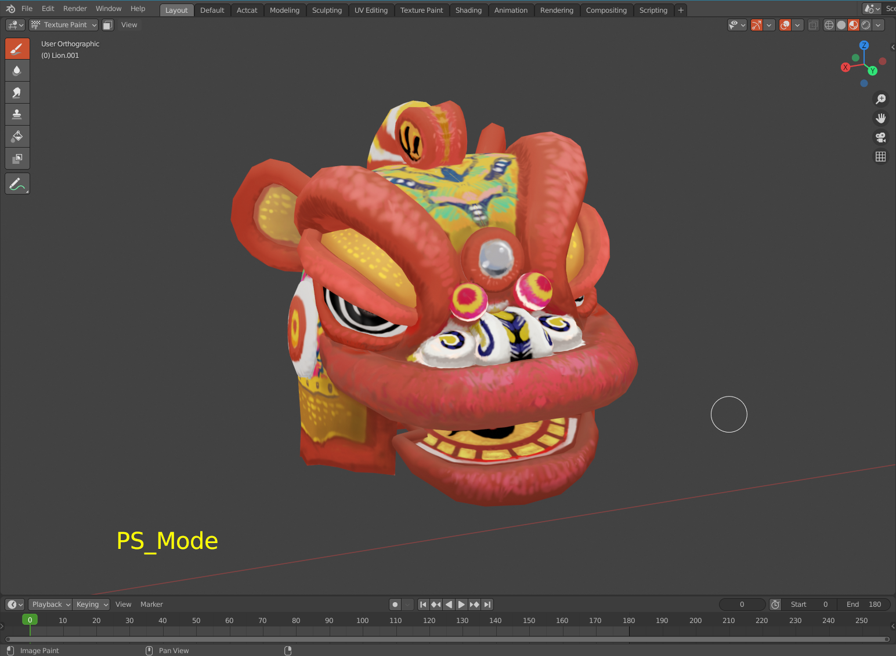

   3D Viewport range

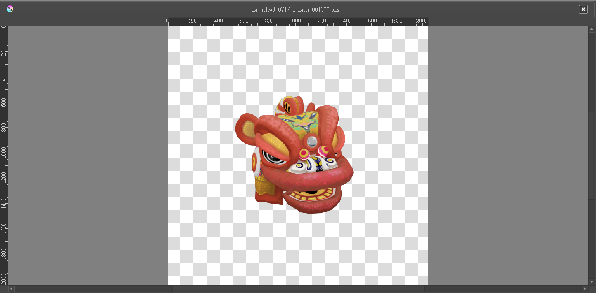

   Blender default screen capture range

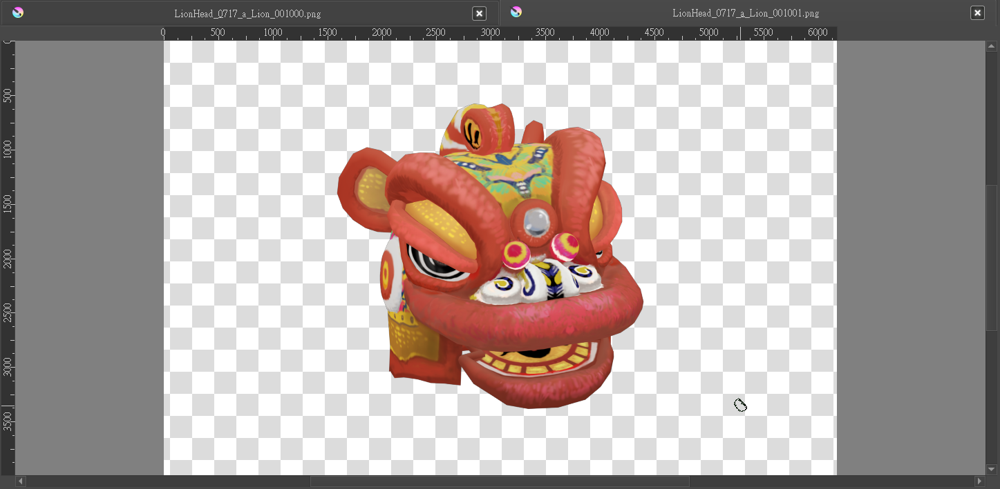

   ACPainter improved screen capture range   

Screen Self-Projection
==================================
The screen self-projection function is convenient for projecting any image in the 3D window to the ACPainter layer, including 
Eevee's screen post-production effects can also be captured. Here is a simple example:

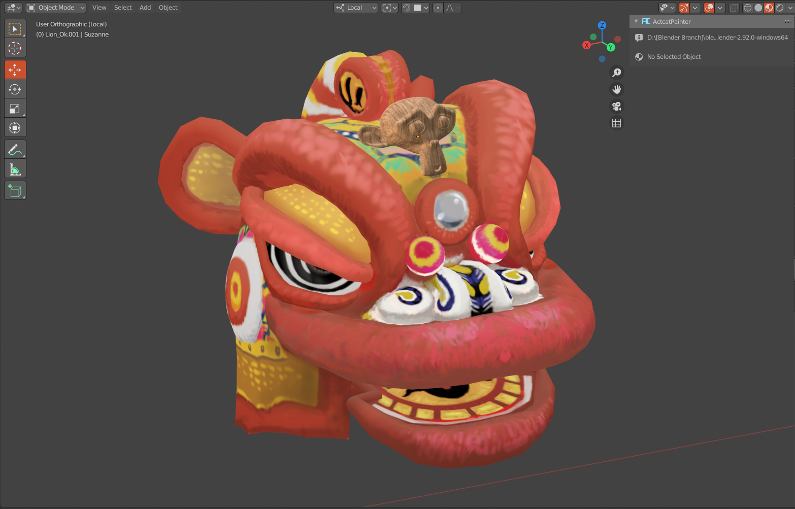

   Set materials and position of the monkey head model

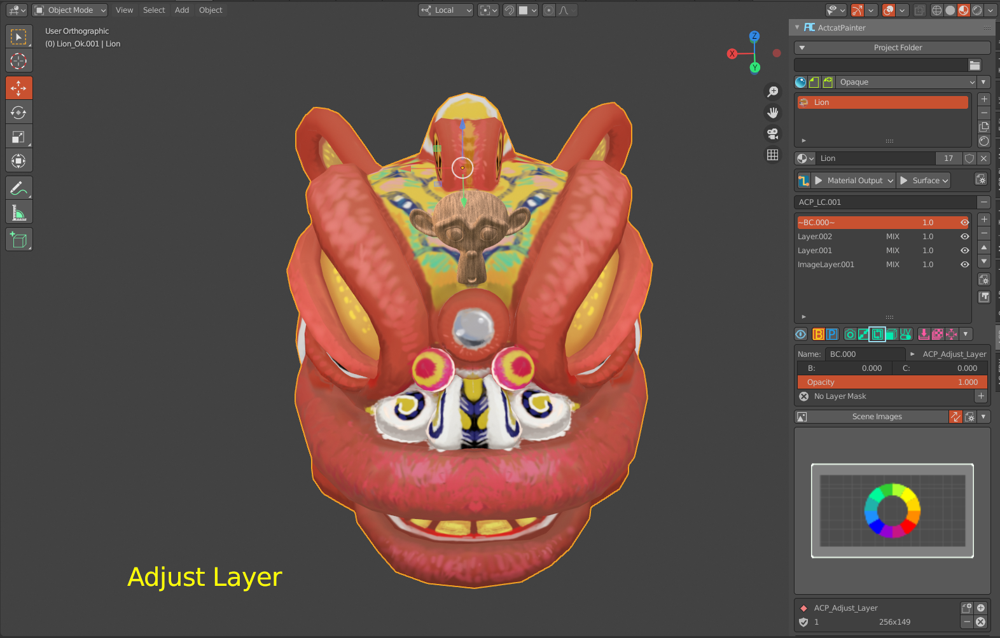

   Rotate 3D Viewport to a suitable angle.

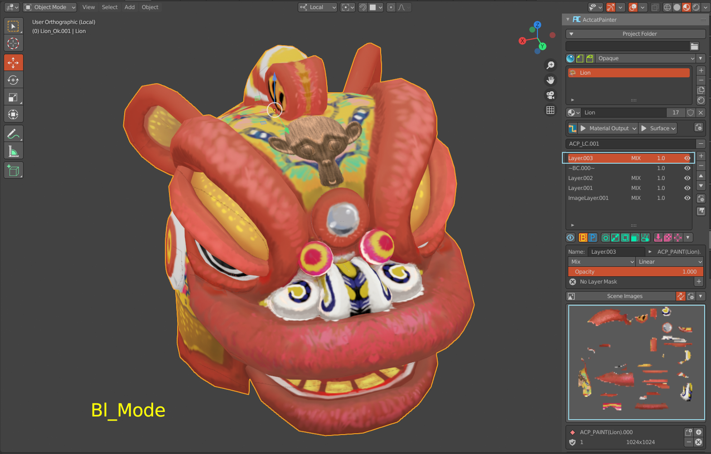

   The image of the monkey head is projected onto the layer.

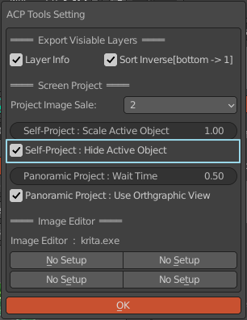

   turns off the self-projection object display, and only objects outside the self-projection object can be projected.

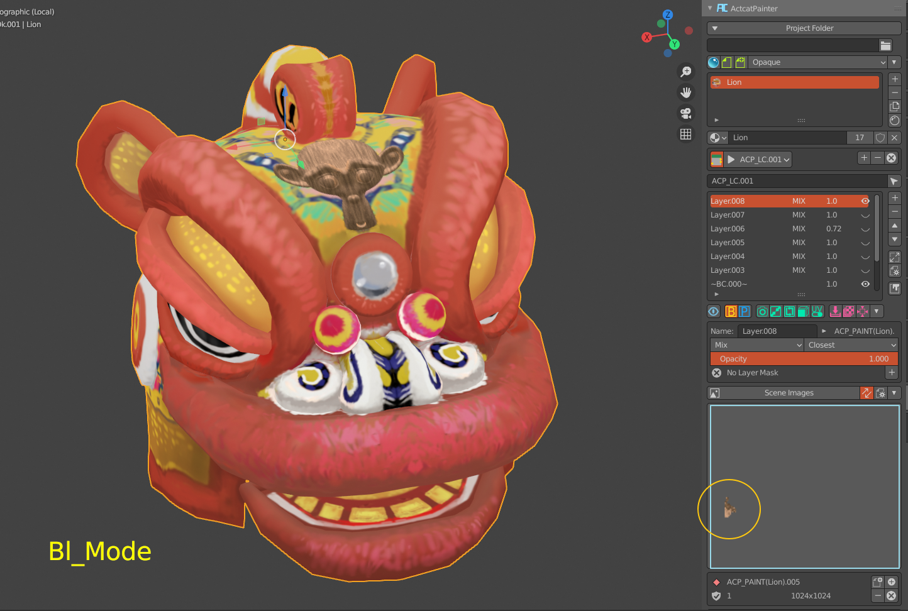

   The layer only has the projection data of objects other than its own object.

Screen Panoramic Projection
===========================
Screen panoramic projection uses six orthogonal window screen self-projection to quickly obtain the image effect in the window and project it 
on the object, which can quickly create object textures and convert material effects into textures. The following are examples of effects:

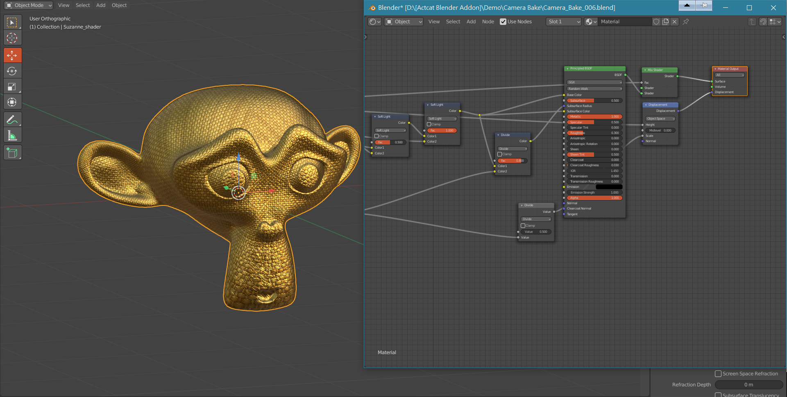

   Set materials and details of the model.

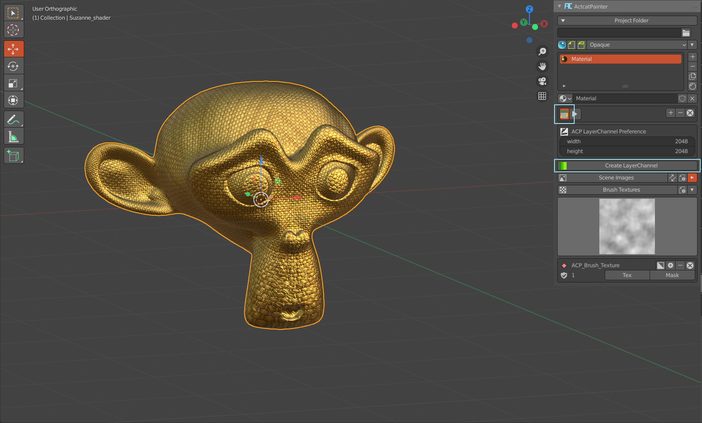

   In the free mode, add a new layer channel for Bake.

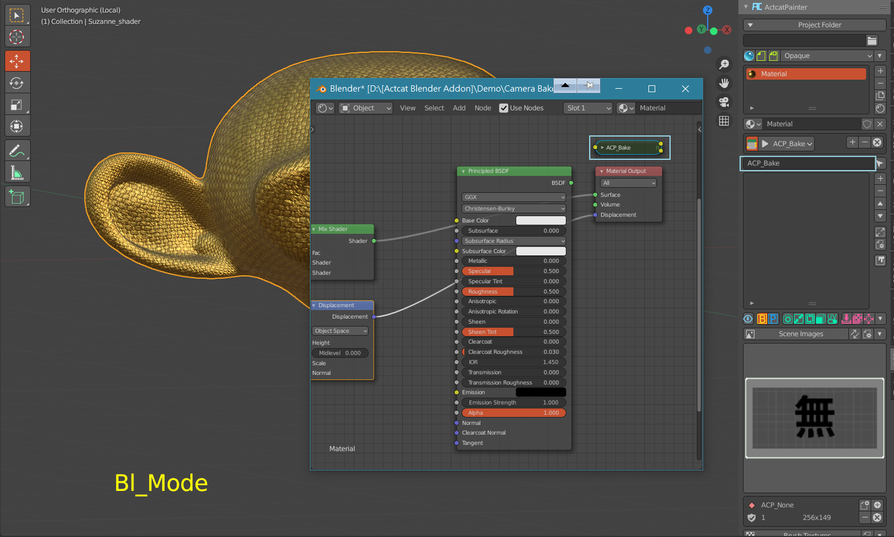

   Add a new layer names "ACP_Bake"

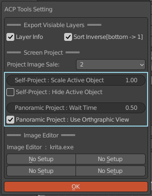

   Sets the screen panorama projection parameters.

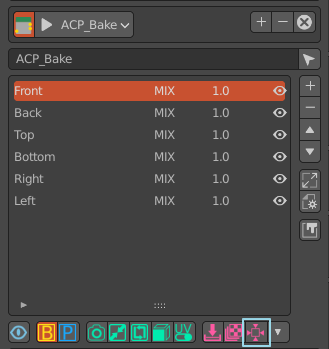

   Press the button and wait for the completion of the screen panorama projection. After completion, there will be six layers named Front, 
   Back, Left, Right, Top, and Bottom.

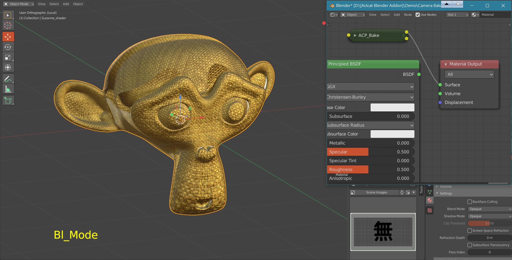

   Connect the ACP_Bake node to the material output and check the effect in the 3D Viewport. According to the characteristics and purposes of 
   the model, the order of the six layers can be adjusted to obtain the best effect. The layer seam can be removed by adding a layer mask. 

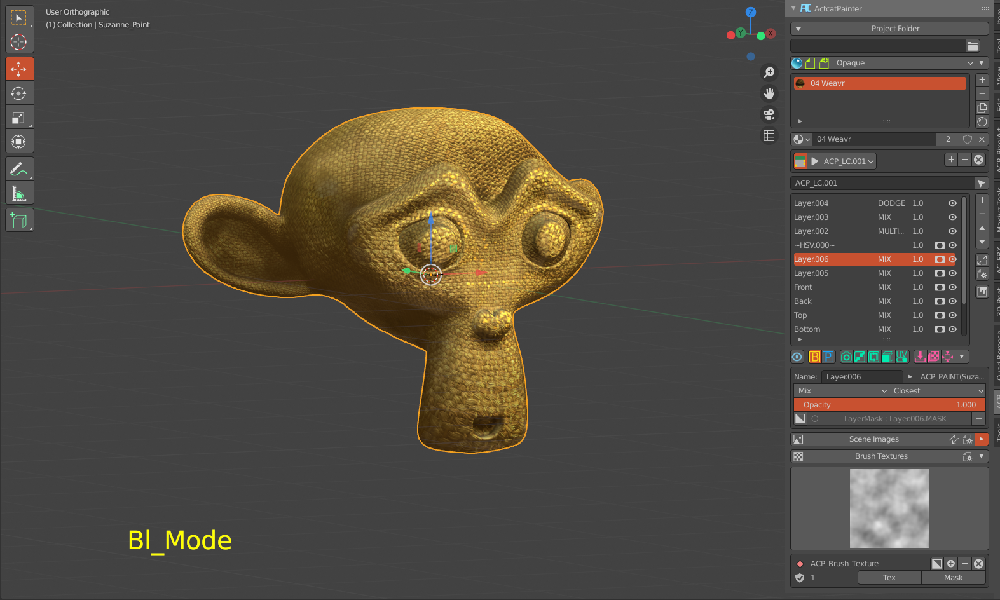

   Completed after simple adjustment (about 15 minutes).

For more advanced skills, see the chapter on using skills.